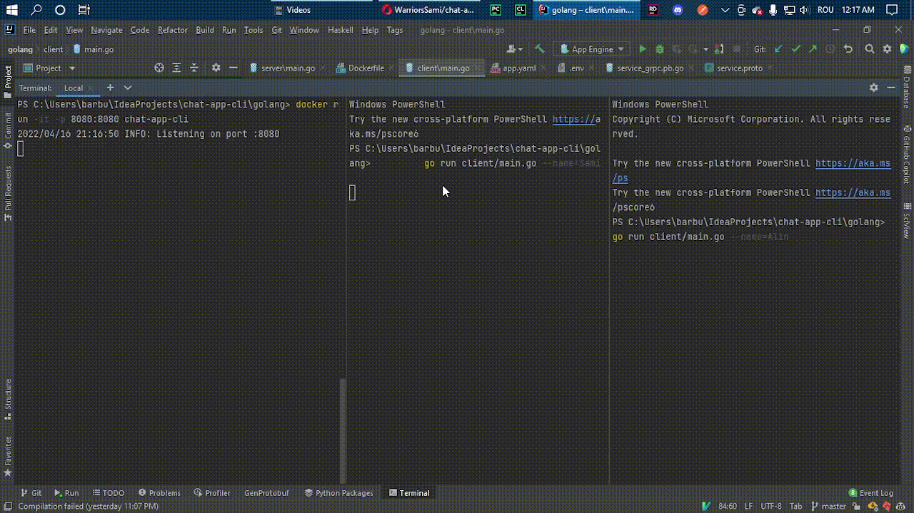

# chat-app-cli
Basic Chat App designed for CLI in Rustlang and, respectively, Golang (the former using TCP Listener and Stream and the latter using gRPC and Docker).

### CLI Chat App - Rustlang implementation using TcpListener and TcpClient

### CLI Chat App - Golang implementation using gRPC and Docker

